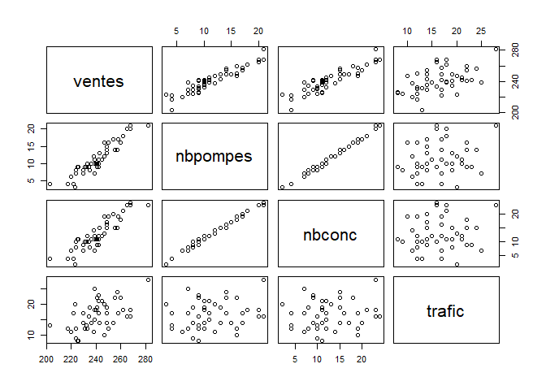
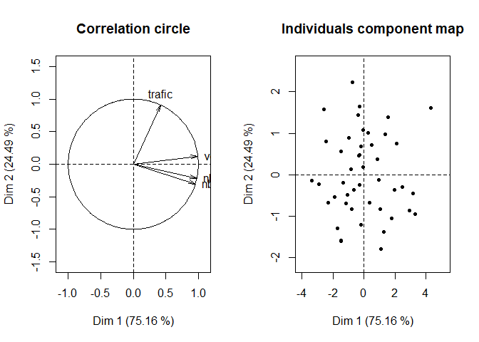
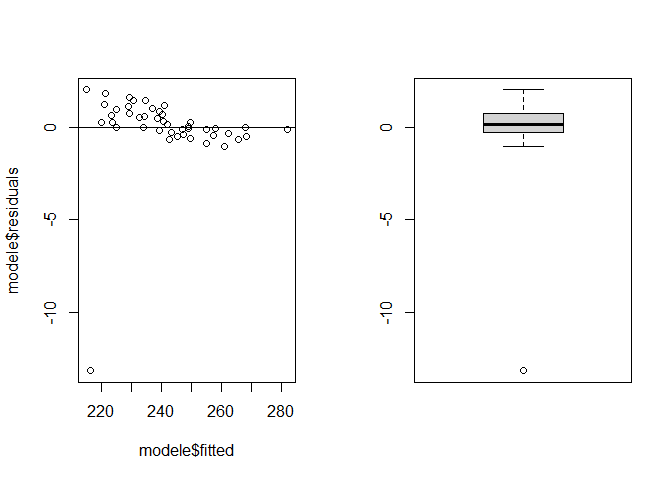

Régression Linéaire Multiple : “station”
================
Thibaut Fortuné
11/11/2021

# 1. Etude descriptive des données

## Importation du jeu de données “station.txt”

``` r
station <- read.table("station.txt", header = 1)
```

## Sommaire des données

``` r
head(station)
```

    ##   ventes nbpompes nbconc trafic
    ## 1    203        4      4     13
    ## 2    262       18     21     18
    ## 3    247       16     19     10
    ## 4    239       11     12     15
    ## 5    241       10     11     19
    ## 6    217        4      4     12

``` r
plot(station[,1:4])
```

<!-- -->

On remarque une dépendance linéaire croissante des **ventes** avec le
**nbpompes** et le **nbconc**. En revanche, le lien du nombre de
**ventes** avec le **trafic** est beaucoup plus flou.

## Réalisation d’une ACP

``` r
library(PCAmixdata)

res <- PCAmix(station[,1:4], graph = FALSE)
```

### Déterminantion du nombres d’axes à retenir

``` r
round(res$eig, digit = 2)
```

    ##       Eigenvalue Proportion Cumulative
    ## dim 1       3.01      75.16      75.16
    ## dim 2       0.98      24.49      99.65
    ## dim 3       0.01       0.32      99.97
    ## dim 4       0.00       0.03     100.00

Il est intéressant d’explorer les données sous 2 dimensions qui
représenterait presque la totalité de nos 4 variables (3,01 + 0,98),
soit 99,65% de l’information.

### Représentation des variables dans un sous espace de dimension 2

``` r
par(mfrow = c(1,2))
plot(res, axes = c(1, 2), choice = "cor")
plot(res, axes = c(1, 2), choice = "ind")
```

<!-- -->

En regardant le cercle de corrélation, on s’apperçoit que les **ventes**
sont corrélées avec le **nbpompes** et le **nbconc** qui sont d’ailleurs
très linéaires entre-elles. En revanche, le **trafic** semble impacter
les **ventes** d’une façon plus modérée.

### Test de la fiabilité des variables en fonction du nombres de dimension

``` r
round(res$quanti$cos2, digit = 3)
```

    ##          dim 1 dim 2 dim 3 dim 4
    ## ventes   0.976 0.015 0.008 0.000
    ## nbpompes 0.951 0.047 0.001 0.001
    ## nbconc   0.905 0.092 0.002 0.001
    ## trafic   0.173 0.826 0.001 0.000

En dimension 1 et 2, nous pourrons représenter nos variable avec une
certitude proche de 100%.

# 2. Explication du modèle à trois variables

``` r
modele <- lm(ventes~nbpompes+nbconc+trafic, data = station)
summary(modele)
```

    ## 
    ## Call:
    ## lm(formula = ventes ~ nbpompes + nbconc + trafic, data = station)
    ## 
    ## Residuals:
    ##      Min       1Q   Median       3Q      Max 
    ## -13.1412  -0.2876   0.1360   0.7434   2.0179 
    ## 
    ## Coefficients:
    ##             Estimate Std. Error t value Pr(>|t|)    
    ## (Intercept) 189.7673     1.6530 114.804  < 2e-16 ***
    ## nbpompes      2.5507     1.3888   1.837   0.0735 .  
    ## nbconc        0.2755     1.1504   0.239   0.8119    
    ## trafic        1.1592     0.1464   7.920 8.55e-10 ***
    ## ---
    ## Signif. codes:  0 '***' 0.001 '**' 0.01 '*' 0.05 '.' 0.1 ' ' 1
    ## 
    ## Residual standard error: 2.213 on 41 degrees of freedom
    ## Multiple R-squared:  0.9811, Adjusted R-squared:  0.9797 
    ## F-statistic: 709.1 on 3 and 41 DF,  p-value: < 2.2e-16

Ici, nous avons une p-valeur \< 5% qui rejette l’H0 : “le modèle est
inutile”.  
En revanche, seulement le **trafic** est en corrélation avec le modèle.
Hors nous avons remarqué précédement que les variables qui expliquent le
mieux le nombre de **ventes** sont **nbpompes** et **nbconc**. Ce
problème peut être dû à la multicolinéarité de ces deux variables comme
vu dans l’analyse ACP. Cette multicolinéarité existante masque la
significativité des p-valeurs de nos variables. De plus, nous remarquons
que dans les résidus il y a un extreme minimum à -13,1412 (voir
graphiques ci-dessous).  
**Nous allons donc définir un meilleur modèle.**

## Représentation des résidus

``` r
par(mfrow = c(1, 2))
plot(modele$fitted,modele$residuals)
abline(h=0)
boxplot(modele$residuals)
```

<!-- -->

## Retrait de la station qui ne répond pas à la normalité

### On cherche la station qui ne correspond pas à la normalité des résidus

``` r
out <- which(modele$residuals < -10)
print(out)
```

    ## 1 
    ## 1

La station qui pose problème dans notre modèle est la station 1. Après
vérification de la base de données, elle possède un nombre de ventes
inférieure à d’autres stations avec des variables **nbpomp**, **nbconc**
et **trafic** similaires. Nous pouvons conseiller au Diercteur Marketing
de se rendre sur place pour constater d’un potentiel événement
exceptionnel sur cette station (travaux…) qui la ferait sortir de la
normalité.

### On recréer une base de donées station “porpre”

``` r
station <- station[-out,]
modele <- lm(ventes~nbpompes+nbconc+trafic, data = station)
summary(modele)
```

    ## 
    ## Call:
    ## lm(formula = ventes ~ nbpompes + nbconc + trafic, data = station)
    ## 
    ## Residuals:
    ##     Min      1Q  Median      3Q     Max 
    ## -0.6747 -0.4380 -0.1948  0.4885  0.8659 
    ## 
    ## Coefficients:
    ##              Estimate Std. Error t value Pr(>|t|)    
    ## (Intercept) 192.48643    0.38182 504.135  < 2e-16 ***
    ## nbpompes      3.47407    0.31198  11.136 7.94e-14 ***
    ## nbconc       -0.57848    0.25877  -2.236    0.031 *  
    ## trafic        1.03561    0.03299  31.393  < 2e-16 ***
    ## ---
    ## Signif. codes:  0 '***' 0.001 '**' 0.01 '*' 0.05 '.' 0.1 ' ' 1
    ## 
    ## Residual standard error: 0.4942 on 40 degrees of freedom
    ## Multiple R-squared:  0.9989, Adjusted R-squared:  0.9988 
    ## F-statistic: 1.243e+04 on 3 and 40 DF,  p-value: < 2.2e-16

Avec ce nouveau modèle, néttoyé de l’individu station1 :  
La p-valeur \< 5%, qui rejette l’H0 : le modèle est inutile.  
De plus, les variables **nbpompes**, **nbconc** et **trafic** ont aussi
une p-valeur \< 5%, qui rejette l’H0 : les variables sont utiles au
modèle. Néanmoins, le **nbconc** avec une p-valeur de 3,1% semble moins
en corrélation avec le modèle que les deux autres variables.

## Définition du modèle à 2 variables

``` r
drop1(modele)
```

    ## Single term deletions
    ## 
    ## Model:
    ## ventes ~ nbpompes + nbconc + trafic
    ##          Df Sum of Sq     RSS     AIC
    ## <none>                  9.771 -58.209
    ## nbpompes  1    30.291  40.063   1.875
    ## nbconc    1     1.221  10.992 -55.029
    ## trafic    1   240.751 250.522  82.532

Pour définir un modèle à 2 variables la fonction **drop1()** nous
suggère de ne retirer aucune variable au modèle.  
Cependant, comme vu dans le **summary()** du modèle à 3 variables, le
**nbconc** a une p-valeur à 3,1% tandis que les les deux autres
variables en ont une proche de 0%. De plus, son coefficient est proche
de 0.

Nous allons alors essayer de simplifier ce modèle pour en faire un
modèle à 2 variables pour expliquer les **ventes** en fonction du
**nbpompes** et du **trafic**. Cette opération n’affectera que très peu
le score AIC du modèle qui passera à -55,029.

### Modèle sous forme **ventes**\~**nbpompes**+**trafic**

# 3. Etude du nouveau modèle à 2 variables

## a. Analyse des indices de qualité du modèle

``` r
modele <- lm(ventes~nbpompes+trafic, data = station)
summary(modele)
```

    ## 
    ## Call:
    ## lm(formula = ventes ~ nbpompes + trafic, data = station)
    ## 
    ## Residuals:
    ##      Min       1Q   Median       3Q      Max 
    ## -0.85703 -0.44413 -0.04286  0.37860  0.89185 
    ## 
    ## Coefficients:
    ##              Estimate Std. Error t value Pr(>|t|)    
    ## (Intercept) 191.98974    0.32530  590.20   <2e-16 ***
    ## nbpompes      2.77766    0.01763  157.53   <2e-16 ***
    ## trafic        1.09956    0.01721   63.88   <2e-16 ***
    ## ---
    ## Signif. codes:  0 '***' 0.001 '**' 0.01 '*' 0.05 '.' 0.1 ' ' 1
    ## 
    ## Residual standard error: 0.5178 on 41 degrees of freedom
    ## Multiple R-squared:  0.9988, Adjusted R-squared:  0.9987 
    ## F-statistic: 1.699e+04 on 2 and 41 DF,  p-value: < 2.2e-16

Avec ce nouveau modèle à 2 variables :  
Le R-squared ajusté = 0,9987 est sensiblement le même qu’avec le modèle
à trois variables (r-squared ajusté = 0,9988).  
La p-valeur \< 5%, donc rejet de l’H0 : le modèle est inutile.  
Les p-valeurs des variables **nbpompes** et **trafic** \< 5%, rejet de
l’H0 : la vraiable est inutile.

### Test de normalité Shapiro-Wilk

``` r
shapiro.test(modele$residuals)
```

    ## 
    ##  Shapiro-Wilk normality test
    ## 
    ## data:  modele$residuals
    ## W = 0.95481, p-value = 0.08319

La p-valeur \> 5%, donc on peut admettre la normalité des résidus du
modèle.

## b. Interprétation du signe des coef. de régression du modèle

Notre modèle à 2 variables est de forme : **ventes = 192 + 2,8 \*
nbpompes + 1,1 \* trafic**.  
Chaque pompe supplémentaire peut rapporter 2,8 milliers de litre vendu
en plus à une station.  
Chaque millier de voitures (+1 **trafic**) peut rapporter 1,1 millier de
litre vendu en plus à une station.  
Aussi, pour qu’une station soit rentable, il faudrait au minimum 192
milliers de litre vendu.

## c. Prédiction des ventes

### Création de trois nouveaux couples de valeurs (nbpompes & trafic)

``` r
set.seed(1278)
newstation = data.frame(nbpompes = sample(min(station$nbpompes):max(station$nbpompes),3), trafic = sample(min(station$trafic):max(station$trafic),3))
print(newstation)
```

    ##   nbpompes trafic
    ## 1       10     27
    ## 2       20     11
    ## 3       15     19

### Prédiction des ventes pour nos trois couples

``` r
predict(modele, newstation, interval = "pred", level = 0.95)
```

    ##        fit      lwr      upr
    ## 1 249.4544 248.3307 250.5781
    ## 2 259.6380 258.5121 260.7639
    ## 3 254.5462 253.4798 255.6126

Avec un **nbpompes** = 10 et un **trafic** = 27 milliers de voiture les
**ventes** prévues sont de environ 249 milliers de litre en moyenne.  
Avec un **nbpompes** = 20 et un **trafic** = 11 milliers de voiture les
**ventes** prévues sont de environ 260 milliers de litre en moyenne.  
Avec un **nbpompes** = 15 et un **trafic** = 19 milliers de voiture les
**ventes** prévues sont de environ 255 milliers de litre en moyenne.

# 4. Modèles linéaires simples vs. Modèle linéaire multiple

## Création de nos trois modèles linéaires simple

**ventes** en fonction du **nbpompes**

``` r
linsimp1 <- lm(ventes~nbpompes, data = station)
summary(linsimp1)
```

    ## 
    ## Call:
    ## lm(formula = ventes ~ nbpompes, data = station)
    ## 
    ## Residuals:
    ##     Min      1Q  Median      3Q     Max 
    ## -9.5639 -3.5420 -0.5164  3.4471 11.5239 
    ## 
    ## Coefficients:
    ##             Estimate Std. Error t value Pr(>|t|)    
    ## (Intercept) 207.6297     2.1214   97.87   <2e-16 ***
    ## nbpompes      2.9927     0.1714   17.46   <2e-16 ***
    ## ---
    ## Signif. codes:  0 '***' 0.001 '**' 0.01 '*' 0.05 '.' 0.1 ' ' 1
    ## 
    ## Residual standard error: 5.129 on 42 degrees of freedom
    ## Multiple R-squared:  0.8789, Adjusted R-squared:  0.876 
    ## F-statistic: 304.7 on 1 and 42 DF,  p-value: < 2.2e-16

**ventes** en fonction du **nbconc**

``` r
linsimp2 <- lm(ventes~nbconc, data = station)
summary(linsimp2)
```

    ## 
    ## Call:
    ## lm(formula = ventes ~ nbconc, data = station)
    ## 
    ## Residuals:
    ##      Min       1Q   Median       3Q      Max 
    ## -12.5063  -4.1096  -0.1066   4.5370  15.5332 
    ## 
    ## Coefficients:
    ##             Estimate Std. Error t value Pr(>|t|)    
    ## (Intercept) 210.9592     2.5356    83.2   <2e-16 ***
    ## nbconc        2.4134     0.1814    13.3   <2e-16 ***
    ## ---
    ## Signif. codes:  0 '***' 0.001 '**' 0.01 '*' 0.05 '.' 0.1 ' ' 1
    ## 
    ## Residual standard error: 6.453 on 42 degrees of freedom
    ## Multiple R-squared:  0.8082, Adjusted R-squared:  0.8037 
    ## F-statistic:   177 on 1 and 42 DF,  p-value: < 2.2e-16

**ventes** en fonction du **trafic**

``` r
linsimp3 <- lm(ventes~trafic, data = station)
summary(linsimp3)
```

    ## 
    ## Call:
    ## lm(formula = ventes ~ trafic, data = station)
    ## 
    ## Residuals:
    ##     Min      1Q  Median      3Q     Max 
    ## -24.811  -7.598  -2.255   6.769  26.658 
    ## 
    ## Coefficients:
    ##             Estimate Std. Error t value Pr(>|t|)    
    ## (Intercept) 215.4648     7.0347  30.629  < 2e-16 ***
    ## trafic        1.6173     0.4111   3.934 0.000307 ***
    ## ---
    ## Signif. codes:  0 '***' 0.001 '**' 0.01 '*' 0.05 '.' 0.1 ' ' 1
    ## 
    ## Residual standard error: 12.6 on 42 degrees of freedom
    ## Multiple R-squared:  0.2693, Adjusted R-squared:  0.2519 
    ## F-statistic: 15.48 on 1 and 42 DF,  p-value: 0.0003073

## Comparaison avec notre modèle à 2 variables

Premièrement, nous pouvons voir qu’avec trois modèles de régression
linéaire simple il est plus compliqué d’expliquer les **ventes** en
fonction d’une seule vraiable. En effet, les modèles exprimées en
fonction du **nbpompes**, du **nbconc** ou du **trafic** expliquent
respectivelent les **ventes** qu’à hauteur de 87,6%, 80,37% et 24,19%.  
Un R² ajusté, au mieux plus 10% inférieur à notre modèle de régression
linéaire multiple ayant un R² ajusté expliquant 99,87% des **ventes** en
fonction du **nbconc** et du **trafic**.

## Estimation avec nos trois modèles linéaires simples

``` r
set.seed(1278)
newstation = data.frame(nbpompes = sample(min(station$nbpompes):max(station$nbpompes),3), nbconc = sample(min(station$nbconc):max(station$nbconc),3), trafic = sample(min(station$trafic):max(station$trafic),3))

print("**Prédiction des ventes en fonction du nbpomp**")
```

    ## [1] "**Prédiction des ventes en fonction du nbpomp**"

``` r
predict(linsimp1, newstation, interval = "pred", level = 0.95)
```

    ##        fit      lwr      upr
    ## 1 237.5566 227.0757 248.0375
    ## 2 267.4835 256.6127 278.3542
    ## 3 252.5200 241.9835 263.0566

``` r
print("** Prédiction des ventes en fonction du nbconc**")
```

    ## [1] "** Prédiction des ventes en fonction du nbconc**"

``` r
predict(linsimp2, newstation, interval = "pred", level = 0.95)
```

    ##       fit      lwr      upr
    ## 1 261.640 248.1414 275.1386
    ## 2 223.026 209.5419 236.5102
    ## 3 242.333 229.1633 255.5028

``` r
print("**Prédiction des ventes en fonction du trafic**")
```

    ## [1] "**Prédiction des ventes en fonction du trafic**"

``` r
predict(linsimp3, newstation, interval = "pred", level = 0.95)
```

    ##        fit      lwr      upr
    ## 1 238.1071 212.3168 263.8975
    ## 2 247.8110 221.9371 273.6848
    ## 3 241.3417 215.6304 267.0531

``` r
print("**Prédiction des ventes grâce à notre modèle à 2 variables**")
```

    ## [1] "**Prédiction des ventes grâce à notre modèle à 2 variables**"

``` r
predict(modele, newstation, interval = "pred", level = 0.95)
```

    ##        fit      lwr      upr
    ## 1 235.1601 234.0986 236.2217
    ## 2 269.5340 268.4339 270.6342
    ## 3 251.2475 250.1823 252.3127

Nous pouvons de plus constater que nos trois modèles linéaires simples
font des prédictions qui ne sont pas fiables. En effet, celles-ci ne
correspondent pas à l’intervalle d’erreur des valeurs prédites par notre
modèle à 2 variables qui explique pourtant les **ventes** en fonction du
**nbpompes** et du **trafic** à hauteur de 99,87%.
